# 🧳 The Traveling Salesman Problem & Christofides Algorithm

## A 3/2-Approximation for Metric TSP

![20 min talk]

**Lukas** · `netlistx` project · May 2026

---

## Slide 1: 🎯 The Problem

### Traveling Salesman Problem (TSP)

> *"Given a list of cities and the distances between each pair, what is the shortest possible route that visits each city exactly once and returns to the origin city?"*

```python
# We have N cities with pairwise distances
num_nodes = 20
G = nx.complete_graph(num_nodes)         # fully connected
pos = {i: (random.uniform(0,100), ...)}  # random 2D coordinates
```

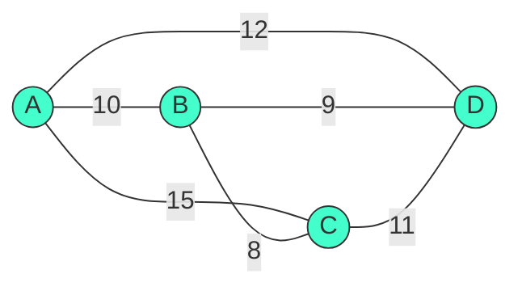

- **Input**: Complete graph $K_n$ with edge weights $w_{ij}$
- **Output**: Hamiltonian cycle of minimum total weight
- **Complexity**: **NP-hard** 🧠 — no polynomial exact algorithm (unless P = NP)

---

## Slide 2: 📐 Why Metric TSP?

### The Triangle Inequality ✨

Our demo uses **Euclidean distances** (a **metric**):

$$w_{ij} = \sqrt{(x_i - x_j)^2 + (y_i - y_j)^2}$$

```python
dist = ((pos[u][0] - pos[v][0]) ** 2 + (pos[u][1] - pos[v][1]) ** 2) ** 0.5
```

A **metric** satisfies:

1. 🌐 $w_{ij} = w_{ji}$ (symmetry)
2. 📏 $w_{ik} \le w_{ij} + w_{jk}$ (triangle inequality)
3. ✅ $w_{ii} = 0$, $w_{ij} > 0$ for $i \ne j$

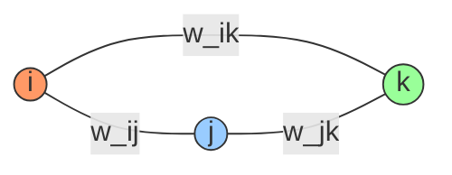

> **Why it matters**: Metric TSP is still NP-hard, but we can **approximate** it efficiently with a guaranteed bound! 🎉

---

## Slide 3: 🏆 Christofides Algorithm — Overview

### Nicos Christofides (1976) — A Beautiful Marriage of Graph Theory 💒

| Step | What | Why |
|------|------|-----|
| **1** 🌲 | Minimum Spanning Tree (MST) | Cheap backbone connecting all nodes |
| **2** 🔢 | Find odd-degree nodes in MST | Eulerian circuits need all-even degrees |
| **3** 💍 | Min-weight perfect matching on odds | Pair them up cheaply |
| **4** 🔗 | Superimpose MST + Matching | Now all degrees are even! |
| **5** 🔄 | Eulerian circuit | Traverse every edge exactly once |
| **6** ✂️ | Shortcut to Hamiltonian cycle | Remove duplicates — triangle inequality saves us |

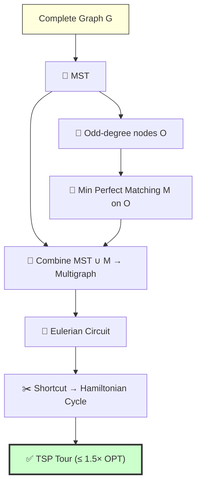

---

## Slide 4: 🌲 Step 1 — Minimum Spanning Tree

Build a tree connecting **all** nodes with minimum total weight.

```python
mst = nx.minimum_spanning_tree(G, weight="weight")
# Kruskal's or Prim's — O(m log n)
```

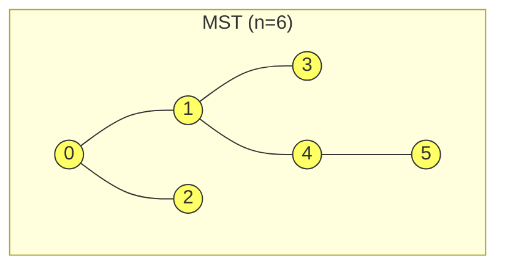

### Key Property 📌

$$w(\text{MST}) \le w(\text{OPT}_{\text{TSP}})$$

Why? Removing one edge from the optimal TSP tour gives a **spanning tree**, and MST is the **minimum** spanning tree. So the MST is a **lower bound** on the optimal TSP solution! 💡

---

## Slide 5: 🔢 Step 2 — Odd-Degree Nodes

Every tree has an **even** number of odd-degree nodes. 🤯

```python
odd_degree_nodes = [v for v, d in mst.degree() if d % 2 != 0]
# This list is ALWAYS even-length!
```

| Node | Degree | Odd? |
|:----:|:------:|:----:|
| 0 | 2 | ❌ |
| 1 | 3 | ✅ |
| 2 | 1 | ✅ |
| 3 | 1 | ✅ |
| 4 | 3 | ✅ |
| 5 | 0 (leaf) | — |

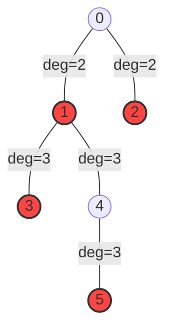

**Why?** $$\sum_{v \in V} \deg(v) = 2|E|$$ is even, and the number of odd-degree vertices must be even (handshaking lemma 🖐️).

---

## Slide 6: 💍 Step 3 — Minimum Weight Perfect Matching

Pair up the odd-degree nodes as **cheaply as possible**.

```python
odd_subgraph = G.subgraph(odd_degree_nodes)
matching = nx.min_weight_matching(odd_subgraph, weight="weight")
# Blossom algorithm — O(n³) 💐
```

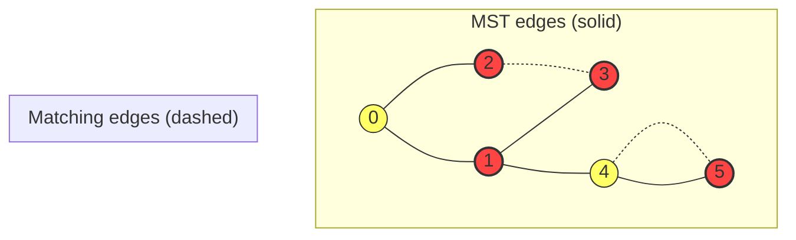

### Why this works 🔑

$$w(\text{matching}) \le \frac{1}{2} w(\text{OPT}_{\text{TSP}})$$

Taking the optimal TSP tour, alternate edges form 2 perfect matchings on the odd set — one of them ≤ half the tour.

---

## Slide 7: 🔗 Step 4 — Combine: MST ∪ Matching

```python
multigraph = nx.MultiGraph(mst)                        # start with MST
multigraph.add_edges_from((u, v, G[u][v]) for u, v in matching)  # add matching
```

Now **every node has even degree**! ✅

```
deg(v) before (MST)       →  odd for some
deg(v) after adding matching →  EVEN for EVERY node
```

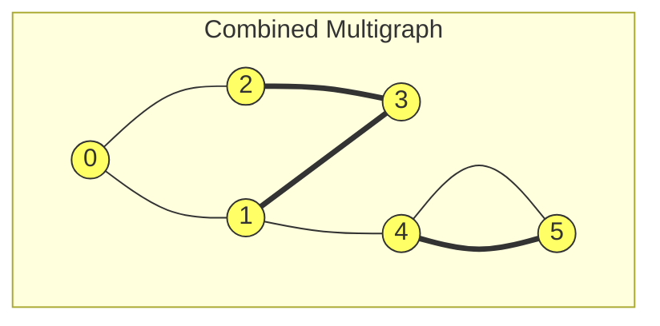

> **All degrees even** ⟹ **Eulerian multigraph** exists! 🚀

---

## Slide 8: 🔄 Step 5 — Eulerian Circuit

Traverse **every edge exactly once** and return to start. Hierholzer's algorithm — $O(|E|)$.

```python
eulerian_circuit = list(nx.eulerian_circuit(multigraph))
# e.g., [0→1, 1→3, 3→2, 2→0, 0→...]
```

```mermaid
graph LR
    subgraph "Eulerian Walk"
        direction LR
        0 --> 1 --> 3 --> 2 --> 0 --> 2 ... 
    end
```

### Visual Example 👁️

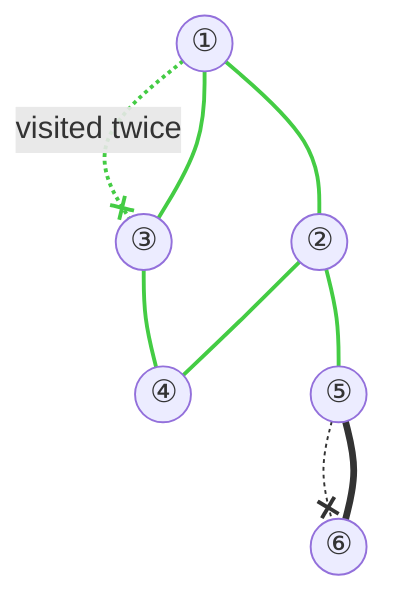

Path: $0 \to 1 \to 3 \to 2 \to 0 \to 2 \to \dots$

> **Problem** 😕: Nodes repeat! (Eulerian ≠ Hamiltonian)

---

## Slide 9: ✂️ Step 6 — Shortcut to Hamiltonian Cycle

**Triangle inequality** to the rescue! 🦸: when we encounter an already-visited node, **skip it**.

```python
path = []
visited = set()
for u, v in eulerian_circuit:
    if u not in visited:
        path.append(u)        # first time → keep
        visited.add(u)
path.append(path[0])  # close the loop
```

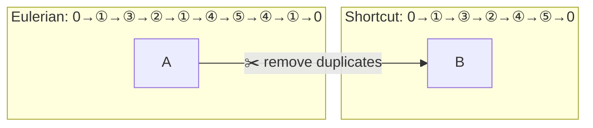

### Why it's valid ✅

Triangle inequality guarantees:

$$w(\text{shortcut edge}) \le w(\text{skipped path})$$

So skipping never **increases** total cost! The resulting tour is **no longer** than the Eulerian circuit. 🎯

---

## Slide 10: 📊 Putting It All Together — The Bound

### The 3/2 Approximation Guarantee 🏅

$$w(\text{Tour}) = w(\text{MST} \cup \text{Matching}) \le w(\text{OPT}) + \frac{1}{2}w(\text{OPT}) = \frac{3}{2} w(\text{OPT})$$

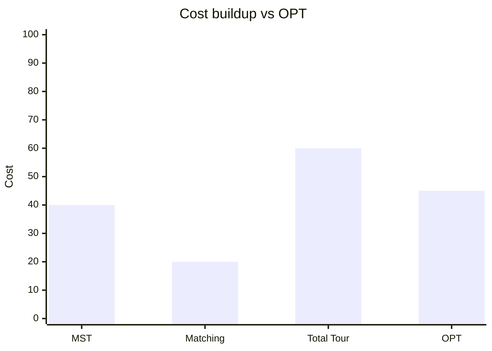

| Component | Bound | Ratio |
|:----------|:------|:-----:|
| 🌲 MST | $\le \text{OPT}$ | 1.0× |
| 💍 Matching | $\le \frac{1}{2}\text{OPT}$ | 0.5× |
| **🔗 Total** | $\le \frac{3}{2}\text{OPT}$ | **1.5×** |
| 🎯 OPT | — | 1.0× |

> **Best possible polynomial-time approximation** for Metric TSP (unless P = NP)! 🏆

---

## Slide 11: 🧪 Demo Walkthrough — Christofides in Action

### Our Experiment: $n = 20$ random cities 🏙️

```python
from netlistx.tsp import christofides_tsp, solve_christofides_2opt_tsp

tsp_path_initial = christofides_tsp(G)           # 3/2-approximation
tsp_path_refined = solve_christofides_2opt_tsp(G) # + 2-Opt refinement
```

### Output 👇

```
Initial Distance (Christofides):         407.12
Refined Distance (Christofides+2-Opt):   389.23
Improvement:                              17.89
```

### Generated Figure 🖼️

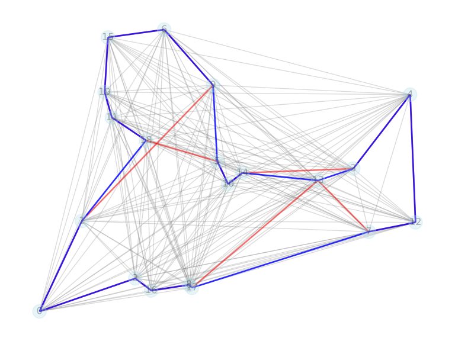

> 🔴 **Red** = Christofides initial tour &nbsp;·&nbsp; 🔵 **Blue** = after 2-Opt refinement
>
> Note how 2-Opt removes crossing segments, producing a shorter, smoother tour.

---

## Slide 12: 🎨 Visualization — Larger Instance (n = 100)

The Christofides + 2-Opt combination scales to larger instances:

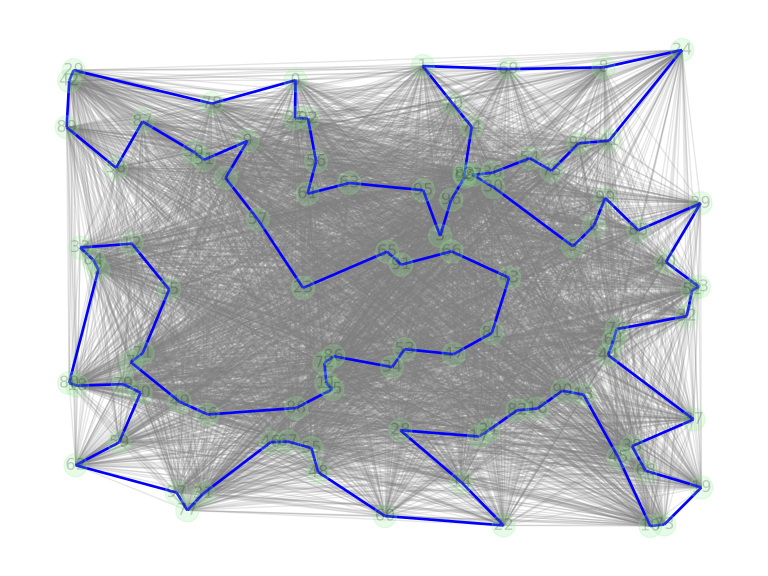

| Metric | Value |
|:-------|:------|
| 🏙 Cities | 100 randomly placed |
| 📏 Initial distance (Christofides) | 875.50 |
| 📏 Refined distance (+2-Opt) | 809.07 |
| 📉 Improvement | **66.43 (7.6%)** |

### Observations 👁️
- The tour is smooth with **no crossing edges** — 2-Opt guarantees this
- Node labels are omitted for readability at this scale
- The algorithm completes in a few seconds for $n = 100$

---

## Slide 13: ⏱ Complexity Analysis

| Step | Algorithm | Complexity |
|:-----|:----------|:----------:|
| 🌲 MST | Kruskal / Prim | $O(m \log n)$ |
| 🔢 Odd-degree scan | Degree check | $O(n)$ |
| 💍 Min-weight perfect matching | Blossom algorithm 🌸 | $O(n^3)$ |
| 🔗 Combine | Edge addition | $O(n)$ |
| 🔄 Eulerian circuit | Hierholzer | $O(m)$ |
| ✂️ Shortcut | Linear scan | $O(n)$ |
| **Total** | **Christofides** | **$O(n^3)$** 🐌 |

### Scalability 📈

| $n$ (cities) | Rough time |
|:------------:|:----------:|
| 20 | ~ms ⚡ |
| 100 | ~seconds |
| 1,000 | ~minutes |
| 10,000 | ~hours (matching dominates) |

> **Bottleneck**: Minimum weight perfect matching (Blossom). For huge $n$, use heuristics instead.

---

## Slide 14: 🧮 Why Can't We Do Better?

### The Approximation Landscape 🗺️

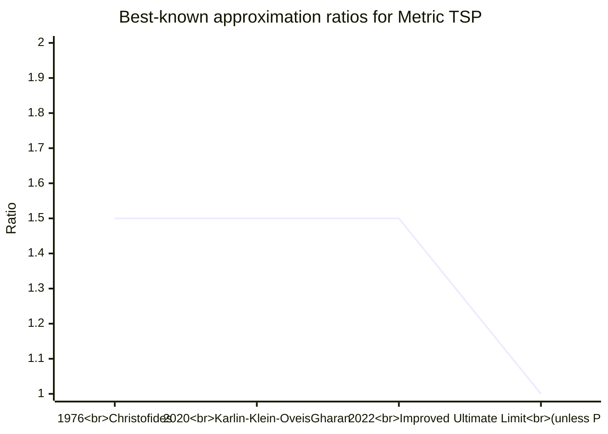

**Wait, is Christofides still state-of-the-art?** 🤔

| Year | Result | Ratio |
|:----:|:-------|:-----:|
| 1976 🏛 | **Christofides** | **1.5** |
| 2020 | Karlin, Klein, Oveis Gharan | $1.5 - \epsilon$ |
| 2022 | Improved analysis | $1.5 - 2\cdot 10^{-6}$ |
| ? | Inapproximability | $> 1.0045$ (under ETH) |

> Despite tiny improvements, **Christofides remains the conceptual foundation** after 50 years! 🎉

---

## Slide 15: 🧪 Variations & Extensions

### Beyond Metric TSP 🔭

| Variant | Constraint | Christofides work? |
|:--------|:-----------|:------------------:|
| 🌐 **Metric TSP** | Triangle inequality | ✅ 1.5-approx |
| 🛩 **Asymmetric TSP** | $w_{ij} \ne w_{ji}$ | ❌ |
| 🗺 **Graphical TSP** | Distances = shortest path | ✅ |
| 📦 **TSP with neighborhoods** | Visit regions, not points | ❌ |
| 🚛 **Vehicle Routing (VRP)** | Multiple vehicles | ❌ (different problem) |
| ⏰ **TSP with time windows** | Deadline constraints | ❌ |

### In `netlistx` Context 🔌

Christofides-style techniques relate to:

- **Netlist partitioning** — find cheap cuts (matching!)
- **Placement optimization** — minimize wire length (metric!)
- **Routing** — Eulerian paths for wire routing

---

## Slide 16: 📜 History & Legacy

### Timeline of TSP 🕰️

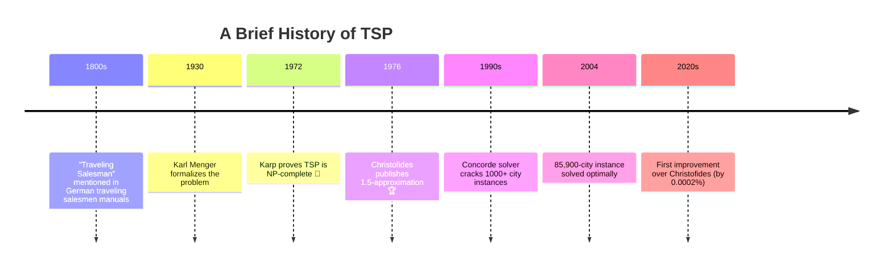

### Why It Matters 🌍

- 🚚 **Logistics** — delivery route optimization
- 🧬 **Genome sequencing** — DNA fragment assembly
- 💻 **VLSI design** — drilling, circuit board routing
- 🏭 **Manufacturing** — CNC machine path planning
- 🛰 **Satellite** — telescope scheduling

---

## Slide 17: 🔬 Hands-on: Try It Yourself

### Run the Demo 🖥

```bash
python experiments/tsp_demo.py
```

### Experiment Ideas 🔧

1. **Vary $n$**: try 10, 50, 100 cities — how does runtime scale?
2. **Compare to Nearest Neighbor** heuristic (greedy):
   $$w(\text{NN}) / w(\text{OPT}) \approx O(\log n)$$
3. **Break the triangle inequality** ➡ observe ratio degrade
4. **Visualize each step** — add `plt.pause()` between steps for an animation!

### Starter Code 🚀

```python
def nearest_neighbor_tsp(G, start=0):
    """Greedy TSP — O(n²), no guarantee"""
    path, visited = [start], {start}
    curr = start
    while len(path) < len(G):
        nxt = min((n for n in G[curr] if n not in visited),
                  key=lambda x: G[curr][x]['weight'])
        path.append(nxt); visited.add(nxt); curr = nxt
    path.append(start)
    return path
```

---

## Slide 18: 📚 Key Takeaways

### 🎓 What You Learned Today

| Concept | Key Insight |
|:--------|:------------|
| 🌲 **MST as lower bound** | Any spanning tree ≤ optimal tour |
| 🔢 **Odd-degree parity** | Handshaking lemma → even count |
| 💍 **Perfect matching** | Pairs odds at ≤ half OPT cost |
| 🔗 **Union preserves evenness** | Eulerian condition met |
| 🔄 **Eulerian circuit** | Traverse all edges exactly once |
| ✂️ **Shortcutting** | Triangle inequality protects cost |
| 📐 **3/2 bound** | Best possible poly-time guarantee |

### The Magic Formula 🪄

$$\boxed{w(\text{Christofides}) \le \frac{3}{2} w(\text{OPT})}$$

### One Sentence Summary 📝

> *Build a cheap backbone (MST), fix the parity (matching), take an Eulerian walk, and shortcut — triangle inequality ensures you never pay more than 50% above optimal.*

---

## Slide 19: 🧩 Proof Sketch (For the Curious)

### Theorem 📐

> Christofides algorithm yields a TSP tour of weight at most $\frac{3}{2} \cdot \text{OPT}$.

**Proof** 🧾:

1. **MST bound**: $$w(\text{MST}) \le \text{OPT}$$ (remove edge from OPT → spanning tree)

2. **Matching bound**: Let $O$ be odd-degree vertices. OPT tour induces 2 perfect matchings on $O$ by taking alternating edges. The cheaper has weight $\le \frac{1}{2} w(\text{OPT})$, so: $$w(\text{matching}) \le \frac{1}{2} \text{OPT}$$

3. **Combined**: $$w(\text{MST} \cup \text{matching}) \le \text{OPT} + \frac{1}{2}\text{OPT} = \frac{3}{2}\text{OPT}$$

4. **Eulerian + Shortcut**: Triangle inequality ensures shortcutting doesn't increase cost. $$\therefore w(\text{final tour}) \le \frac{3}{2} \text{OPT} \quad \blacksquare$$

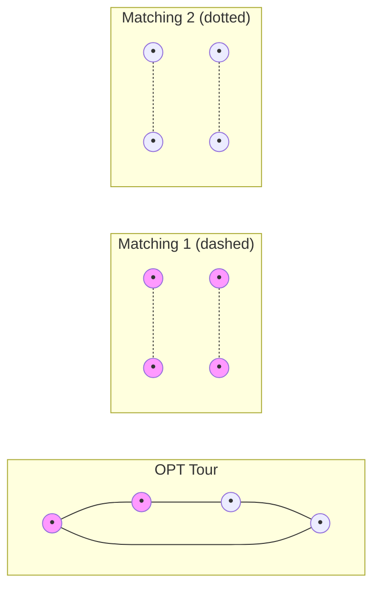

---

## Slide 20: 🙏 Thank You & References

### References 📖

- **Christofides, N. (1976)**. *Worst-case analysis of a new heuristic for the travelling salesman problem*. Carnegie Mellon University. [Report 388]
- **Karlin, A.R., Klein, N., Oveis Gharan, S. (2020)**. *A (Slightly) Improved Approximation Algorithm for Metric TSP*. STOC 2021. [doi:10.1145/3406325.3451009]
- **NetworkX Documentation**: [https://networkx.org/documentation/stable/reference/algorithms/generated/networkx.algorithms.approximation.traveling_salesman.christofides.html](https://networkx.org/documentation/stable/reference/algorithms/generated/networkx.algorithms.approximation.traveling_salesman.christofides.html)

### Code & Project 🗂

| Resource | Location |
|:---------|:---------|
| 🔬 Demo code | `experiments/tsp_demo.py` (n=20) |
| 🔬 Demo code | `experiments/tsp2opt_demo.py` (n=100) |
| 🖼 Figure (n=20) | `experiments/tsp_demo_n20.svg` |
| 🖼 Figure (n=100) | `experiments/tsp2opt_demo_n100.svg` |
| 📦 Library | `netlistx` on [GitHub](https://github.com/luk036/netlistx) |
| 📊 Slides | `experiments/slides_christofides_tsp.md` |

### Questions? 🤔


---

> *"The Traveling Salesman Problem: where computer science, mathematics, and logistics meet — and where approximation algorithms shine."* ✨
