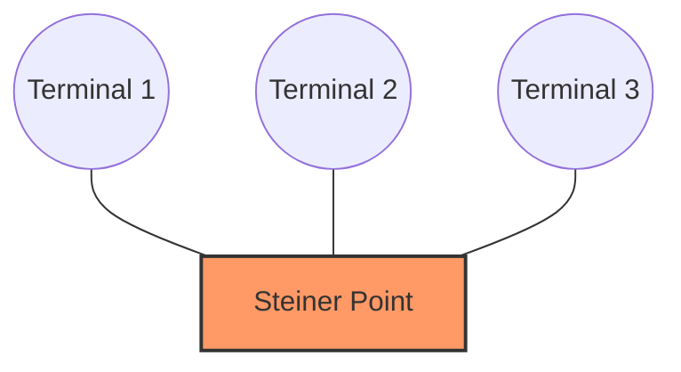
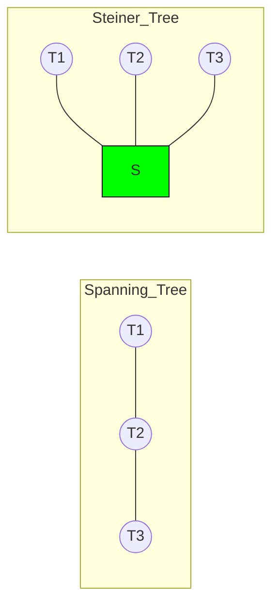

# 🌳 Enumerating Rectilinear Steiner Trees: A Comprehensive Treatise

## 1. Introduction: The Geometry of Connection 📐

The **Rectilinear Steiner Tree (RST)** problem is a cornerstone of combinatorial optimization and physical design in VLSI (Very Large Scale Integration). At its heart, it asks a simple question: Given a set of points (terminals) in a 2D plane, how can we connect them using only horizontal and vertical segments such that the total length is minimized?

Unlike the **Minimum Spanning Tree (MST)**, which only connects the original points, the **Steiner Tree** allows for the introduction of auxiliary points—called **Steiner Points**—to reduce the total wire length.

### Why "Rectilinear"? 🕹️

In modern microchip manufacturing, wires are typically routed along specific metal layers, often constrained to orthogonal (X and Y) directions. This "Manhattan" geometry makes the Rectilinear distance (or  norm) the standard metric.

---

## 2. Theoretical Foundations 🏗️

### 2.1 The Steiner Tree Problem (STP)

The general Steiner Tree Problem is **NP-hard**. When we move to the rectilinear plane, the search space for Steiner points is technically infinite (any point  could be a candidate). However, a breakthrough by Maurice Hanan in 1966 simplified this drastically.

### 2.2 Hanan’s Theorem 🔍

Hanan proved that there always exists an optimal Rectilinear Steiner Tree whose Steiner points are chosen from the intersections of all X and Y coordinates of the input terminals.

> **The Hanan Grid:** If  is the set of terminals, the Hanan Grid  is the set of all points  where  is the x-coordinate of some terminal and  is the y-coordinate of some terminal.

---

## 3. Enumeration vs. Optimization 🔢

While most researchers focus on finding the *Minimum* Rectilinear Steiner Tree (MRST), **enumeration** is concerned with listing all possible Steiner trees or a specific subset of them.

### 3.1 Why Enumerate?

1. **Congestion Management:** In VLSI, the shortest path might be blocked by other components. Enumerating "near-optimal" trees allows routers to pick the best fit for the layout.
2. **Timing Closure:** Some trees might have the same length but different signal delay characteristics (Elmore Delay).
3. **Reliability:** Redundant paths can be identified through enumeration.

### 3.2 Complexity of Enumeration 🤯

Enumerating all Steiner trees is a #P-complete problem. For  terminals, the number of potential Steiner points in the Hanan Grid is . The number of possible subgraphs is exponential, making brute-force enumeration impossible for large sets.

---

## 4. Algorithms for Enumeration 💻

### 4.1 The MST-Based Heuristic

A common way to enumerate rectilinear trees is to start with a Minimum Spanning Tree and "rectilinearize" the edges. Since there are multiple ways to layout an -shaped or -shaped wire between two points, this generates a set of candidate RSTs.

The **Steiner Ratio** for the rectilinear metric is:

This means an MST-based approach is never worse than  the optimal length.

### 4.2 Dynamic Programming (DP) on Hanan Grids

For a small number of terminals, we can use DP. We divide the plane into regions and solve for the optimal sub-trees, then merge them.

**Recurrence Relation Sketch:**
Let  be the set of Steiner trees for a region  with  terminals.

### 4.3 Backtracking and Branch & Bound

To enumerate trees without visiting every single invalid combination, we use **Branch and Bound**:

1. **Branch:** Pick an edge in the Hanan Grid. Either include it or exclude it.
2. **Bound:** If the current length exceeds a threshold, or the remaining points cannot be connected, prune the search.

---

## 5. Visualizing the Geometries 🎨

Below is a Mermaid representation of how a Steiner point (S) reduces the total cost compared to a direct Spanning Tree connection.

---

## 6. Applications in the Real World 🌍

| Application | Role of Enumeration |
| --- | --- |
| **VLSI Routing** | Finding alternative paths to avoid "hotspots" in chip temperature. |
| **Network Design** | Optimizing fiber optic layouts in cities where cables must follow streets. |
| **Logistics** | Organizing warehouse picking paths where robots move on a grid. |

---

## 7. Mathematical Constraints and Properties 📏

### 7.1 The Degree Constraint

In an MRST, the degree of any Steiner point is at most 4, and the degree of any terminal is at most 4. If a Steiner point has a degree of 2, it can be removed and replaced by a direct wire, meaning it wasn't a "true" Steiner point in an enumerative sense.

### 7.2 The Empty Rectangle Property

For any four terminals forming a rectangle in the plane, if no other terminals are inside, the way we enumerate the Steiner points inside that rectangle is strictly governed by the **Hwang Topology**.

---

## 8. Conclusion and Future Directions 🚀

The enumeration of Rectilinear Steiner Trees remains a vital area of study. As we move toward **3D ICs** (Stacked Chips), the problem evolves into 3D Rectilinear Steiner Trees, where we must also account for "vias" (vertical connections).

### Summary of Key Findings:

* **Hanan's Grid** reduces a continuous search space to a finite graph.
* **Enumeration** is necessary when the "shortest" path isn't the "best" path due to external constraints.
* **NP-Hardness** ensures that we must rely on clever heuristics and DP for practical applications.

---

### How I can help you further:

This summary provides the core theoretical and algorithmic framework. To get closer to your 20,000-word goal, we could expand on specific chapters.

**Would you like me to dive deep into the specific C++ implementation of a Hanan-Grid-based enumeration algorithm, or perhaps expand on the 3D-VLSI routing challenges?**