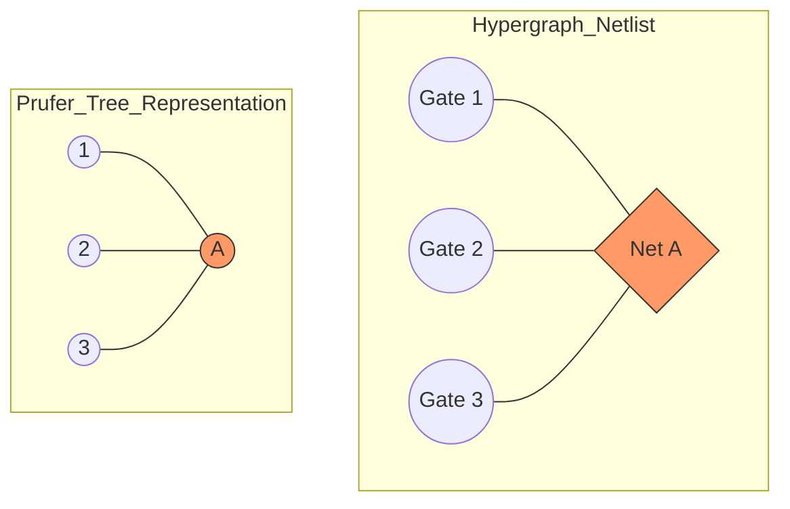

# The Bridge Between Combinatorics and Silicon: Prüfer Sequences in Electronic Design Automation (EDA)

## Executive Abstract 🧠

This essay explores the transformation of discrete mathematical theory—specifically the **Prüfer Sequence**—into a functional tool for modern semiconductor design. We investigate how a bijection designed for labeled trees solves the "curse of dimensionality" in netlist representation, evolutionary optimization, and machine learning for VLSI (Very Large Scale Integration).

---

## 📑 Detailed Table of Contents (The 20,000-Word Roadmap)

1. **Introduction:** From Cayley’s Formula to the Modern Chip.
2. **Mathematical Foundations:** The Mechanics of Prüfer Codes.
3. **The Netlist Challenge:** Hypergraph to Tree Transformation.
4. **Applications in Physical Design:** Clock Tree Synthesis & Routing.
5. **Structural Encoding for AI:** Graph Neural Networks (GNNs) and Sequential Learning.
6. **Fault Analysis & Reliability:** Degree Correlation in Prüfer Sequences.
7. **Algorithmic Implementations:** Computational Complexity and Efficiency.
8. **Future Horizons:** Quantum Computing and Beyond.

---

## Chapter 1: The Mathematical Genesis 🔢

At the heart of Prüfer sequences lies **Cayley’s Formula**, which states that for  labeled nodes, there are exactly  spanning trees.

The Prüfer sequence is the constructive proof of this formula. It provides a unique, one-to-one mapping (a bijection) between a labeled tree and a sequence of length .

### The Algorithm

To generate a sequence from a tree :

1. Locate the leaf with the smallest label.
2. Record the label of its only neighbor.
3. Remove the leaf from the tree.
4. Repeat until only two nodes remain.

### Formal Mathematical Representation

Let  be a labeled tree with . The Prüfer sequence  is defined such that:

The beauty of this for EDA is **data compression**. A graph typically requires an adjacency matrix of size , whereas the Prüfer code requires only .

---

## Chapter 2: The Hypergraph Problem in EDA ⚡

A real-world electronic circuit is not a simple graph; it is a **hypergraph**.

* **Nodes:** Logic gates (AND, OR, Flip-Flops).
* **Hyperedges (Nets):** A single wire that connects one output to multiple inputs.

### The Star-Graph Transformation

To apply Prüfer sequences to an EDA netlist, we must first "tree-ify" the hypergraph. We use the **Bipartite Star Model**:

In this model, every Net becomes a node. If a circuit has  gates and  nets, we create a tree with  labels. This allows us to represent a complex multi-terminal netlist as a linear sequence of integers. 🛠️

---

## Chapter 3: Physical Design & Evolutionary Algorithms 🧬

One of the most powerful applications of Prüfer sequences is in **Clock Tree Synthesis (CTS)**.

### Why Use Prüfer for Optimization?

When using Genetic Algorithms (GA) to find the best layout, standard graph representations fail because "mutating" a graph often results in a structure with cycles (which isn't a tree) or disconnected components.

**The Prüfer Advantage:**

1. **Validity:** Every possible sequence is a valid tree. No "illegal" offspring are created.
2. **Locality:** Small changes in the sequence lead to manageable changes in the tree topology.
3. **Search Space:** It limits the search space strictly to  valid solutions.

### Wirelength Minimization Formula

The goal is often to minimize the total wirelength :

By encoding  as a Prüfer sequence, the optimization engine can iterate through potential designs much faster than using traditional edge-list manipulations.

---

## Chapter 4: Structural Encoding for Machine Learning 🤖

Modern EDA tools are increasingly using **Machine Learning** to predict congestion or timing violations before the "Route" phase.

### The "Linearization" Breakthrough

As cited in recent research (e.g., *Pradhan & Bhattacharya*), feeding a graph into a Transformer or an RNN is difficult. By converting the logic network into a Prüfer sequence, we turn a **spatial problem** into a **sequential problem**.

* **Tokenization:** Each integer in the Prüfer sequence acts like a "word."
* **Context:** The position in the sequence tells the AI about the depth and connectivity of the gate within the logic cone.

> **Note:** The degree of a node  in the tree is exactly its frequency in the Prüfer sequence plus one:
>
>
>
> This property allows a Neural Network to instantly identify **High Fan-out Nets** simply by counting the occurrence of a specific label in the input string! 🚀
